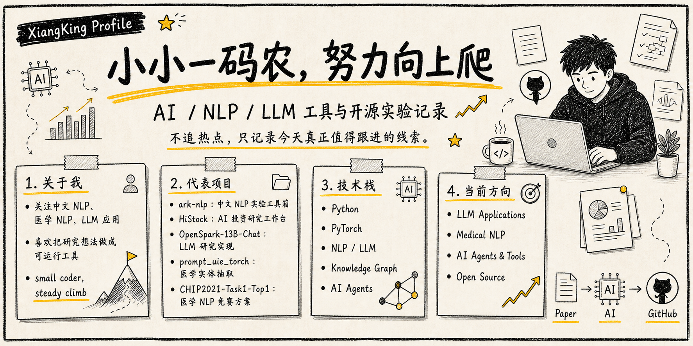

  

  

  
  
  
  

<h3 align="center">Turning research ideas into runnable tools.</h3>

  <table>
    <tr>
      <td align="center" width="760">
        I build practical AI tools across <strong>Chinese NLP</strong>, <strong>Medical NLP</strong>,
        <strong>LLM applications</strong>, and <strong>AI agents</strong>.
      </td>
    </tr>
  </table>

  
  
  
  
  
  

